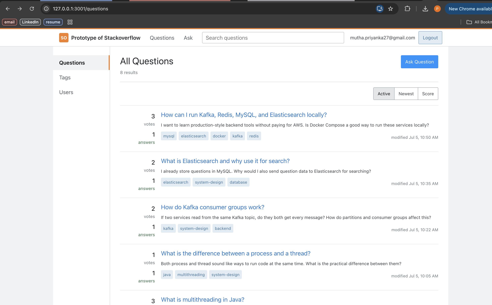
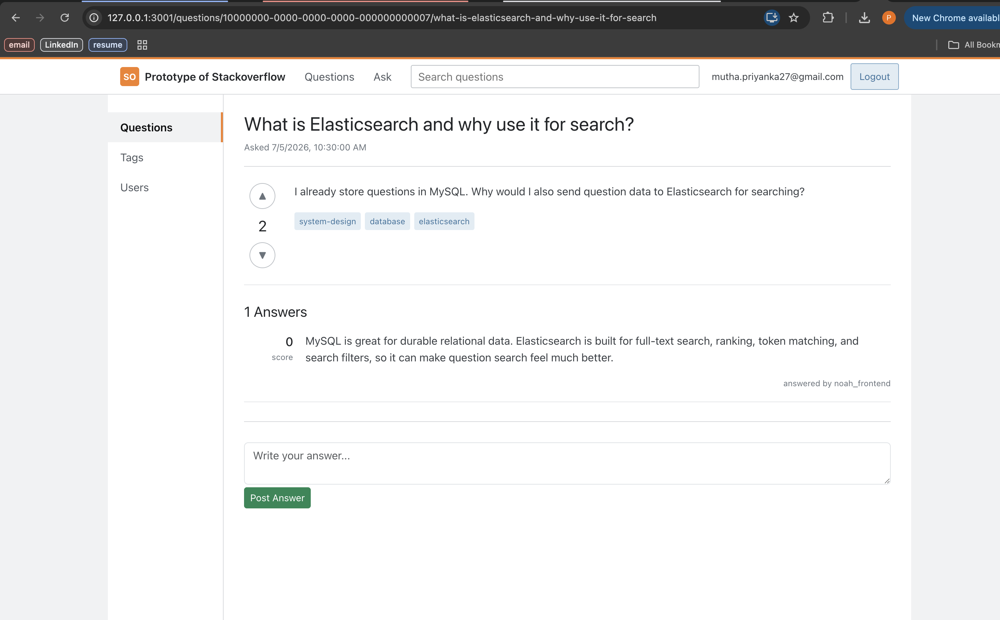

# Prototype of Stackoverflow

A production-shaped Stack Overflow learning project built to run locally with a
real backend stack: Spring Boot, React, MySQL, Redis, Kafka, and Elasticsearch.

The goal is not to clone every Stack Overflow feature. It is to practice the
system-design pieces behind a question-and-answer product: durable writes,
cached reads, event-driven feed updates, searchable content, voting, tags, and a
clean frontend experience.

## Screenshots

### Questions Feed



### Question Detail



## Features

- Login and authenticated question/answer flows
- Stack Overflow-style questions feed with votes, answer counts, excerpts, tags,
  and `Active`, `Newest`, and `Score` tabs
- Question detail page with voting, answers, tags, and readable slug URLs
- Tags and users directory pages
- Redis-backed Spring Cache for fast read paths
- Kafka event publishing for question, answer, and vote changes
- Separate Kafka consumers for feed updates and Elasticsearch indexing
- Elasticsearch-backed search with database fallback
- Local demo seed data for Kafka, Redis, Elasticsearch, Java multithreading, and
  backend learning questions

## Architecture

```text
React frontend
      |
      v
Spring Boot REST API
      |
      +--> MySQL: users, questions, answers, tags, votes
      |
      +--> Redis: cached question list/detail responses
      |
      +--> Kafka topic: stackoverflow.events
                |
                +--> Feed consumer group updates feed_items
                |
                +--> Search index consumer group updates Elasticsearch
      |
      +--> Elasticsearch: full-text question search
```

## Tech Stack

- Frontend: React, React Router, Bootstrap, custom CSS
- Backend: Java, Spring Boot, Spring Security, Spring Data JPA
- Database: MySQL
- Cache: Redis
- Messaging: Kafka
- Search: Elasticsearch
- Local infrastructure: Docker Compose

## Local Services

Start all infrastructure:

```bash
docker compose up -d
```

Service URLs:

- Backend API: `http://localhost:8080`
- Frontend: `http://localhost:3000` or `http://127.0.0.1:3001`
- MySQL: `localhost:3307`
- Redis: `localhost:6379`
- Kafka external listener: `localhost:9094`
- Kafka UI: `http://localhost:8085`
- Elasticsearch: `http://localhost:9200`

MySQL uses host port `3307` to avoid collisions with a local MySQL process on
`3306`.

## Run Backend

```bash
cd backend
./mvnw spring-boot:run
```

Useful health check:

```bash
curl -s http://localhost:8080/actuator/health
```

## Run Frontend

```bash
cd stackoverflow-frontend
npm install
npm start
```

If port `3000` is busy, run:

```bash
HOST=127.0.0.1 PORT=3001 npm start
```

## Seed Demo Data

The repo includes a reusable local seed script with beginner-friendly Q&A
content.

```bash
docker compose exec -T mysql mysql -ustackoverflow_user -pstackoverflow_password stackoverflow_db < scripts/seed-demo-content.sql
```

After reseeding, refresh Redis and Elasticsearch:

```bash
docker compose exec redis redis-cli FLUSHDB
curl -s -X DELETE http://localhost:9200/stackoverflow_questions
curl -s -X POST http://localhost:8080/search/reindex
```

## Kafka Flow

The backend publishes domain events to:

```text
stackoverflow.events
```

Examples:

- `QUESTION_CREATED`
- `QUESTION_DELETED`
- `ANSWER_CREATED`
- `ANSWER_DELETED`
- `VOTE_CREATED`
- `VOTE_UPDATED`
- `VOTE_DELETED`

Consumers:

- `stackoverflow-feed-local`: updates the feed table
- `stackoverflow-search-indexer`: updates Elasticsearch

Open Kafka UI at `http://localhost:8085` to inspect topics, messages, and
consumer groups.

## Redis Flow

Redis is used as a cache, not the source of truth. MySQL stores durable data.

Typical behavior:

- `GET /questions` or question detail reads can populate cache entries
- creating questions/answers/votes evicts stale cached responses
- after a write, Redis may look empty until a read path runs again

Inspect Redis:

```bash
docker compose exec redis redis-cli --scan --pattern 'stackoverflow::*'
```

## Search Flow

Elasticsearch stores searchable question documents with title, body, tags,
answer text, vote count, answer count, creation time, and latest activity time.

Search endpoint:

```bash
curl -s 'http://localhost:8080/search?q=redis&sort=relevance'
```

Reindex endpoint:

```bash
curl -s -X POST http://localhost:8080/search/reindex
```

## Deployment Notes

For a no-cost demo, the easiest path is:

- Deploy the React frontend on Vercel
- Keep the full backend stack local and expose it temporarily with a tunnel

For a cloud demo, use environment variables and consider disabling Kafka or
Elasticsearch first if the target platform does not provide free managed
services.

Useful flags:

```bash
APP_KAFKA_ENABLED=false
APP_SEARCH_ENABLED=false
```

## Project Structure

```text
backend/                 Spring Boot API
stackoverflow-frontend/  React UI
docker-compose.yml       Local MySQL, Redis, Kafka, Kafka UI, Elasticsearch
scripts/                 Local demo seed data
docs/assets/             README screenshots
```
